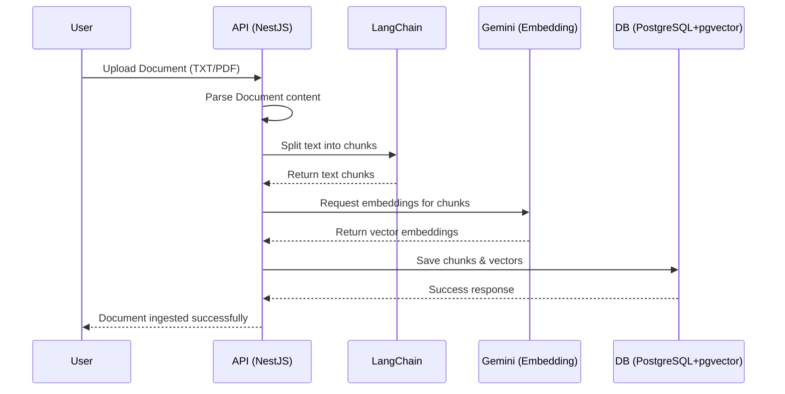
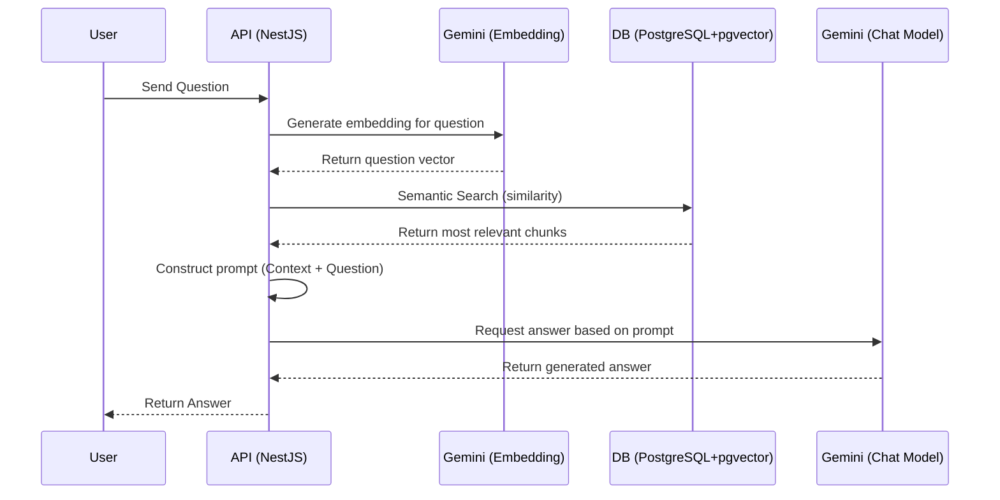

# RAG API

Retrieval-Augmented Generation (RAG) API built with **NestJS**, **Google Gemini**, **LangChain**, and **PostgreSQL (pgvector)**. This application follows **Clean Architecture** and SOLID principles to ensure scalability and maintainability.

## 🚀 Features

- **Document Ingestion**: Upload documents (PDF/TXT) and process them.
- **Text Chunking**: Splits large documents into manageable chunks using LangChain.
- **Vector Embeddings**: Generates embeddings using Google Gemini's Embedding Model.
- **Semantic Search**: Stores and searches vector embeddings using PostgreSQL and `pgvector`.
- **Question Answering**: Formulates prompts with contextual documents and utilizes Google Gemini's Chat Model to answer user questions strictly based on the ingested documents.
- **Clean Architecture**: Separation of concerns between Domain, Application, Presentation, and Infrastructure layers.

## 🏗️ Architecture Flow

### 1. Document Ingestion Flow



### 2. Question Answering (Chat) Flow



## 🐳 Running with Docker

The easiest way to get the application up and running is by using Docker and Docker Compose. This will spin up the API server along with PostgreSQL.

### Prerequisites

- [Docker](https://docs.docker.com/get-docker/)
- [Docker Compose](https://docs.docker.com/compose/install/)
- Google Gemini API Key

### Getting Started

1. **Clone the repository:**
   ```bash
   git clone <repository-url>
   cd rag
   ```

2. **Environment Variables Configuration:**
   Copy the `.env.example` file to `.env`:
   ```bash
   cp .env.example .env
   ```
   Open the `.env` file and fill in your Gemini API key:
   ```env
   GEMINI_API_KEY="your_api_key_here"
   ```

3. **Start the containers:**
   Run the following command to start the application and its infrastructure services:
   ```bash
   docker-compose up -d
   ```

4. **Access the API:**
   - The API will be available at: [http://localhost:3000](http://localhost:3000)
   - The API Docs will be available at: [http://localhost:3000/docs](http://localhost:3000/docs)
   - *Note: On initialization, the container will automatically install dependencies, generate the Prisma client, and apply database migrations (via `entrypoint-development.sh`).*

### Stopping the application

To stop the running containers, execute:
```bash
docker-compose down
```

## 📂 Project Structure

- `src/domain/`: Core business models, interfaces, and entities.
- `src/application/`: Use cases handling specific business logic (e.g., Document Ingestion, Chat).
- `src/infrastructure/`: External integrations (Prisma, Gemini, LangChain, Repositories).
- `src/presentation/`: HTTP controllers and routing mechanisms.
- `src/shared/`: Cross-cutting concerns and shared utilities.
